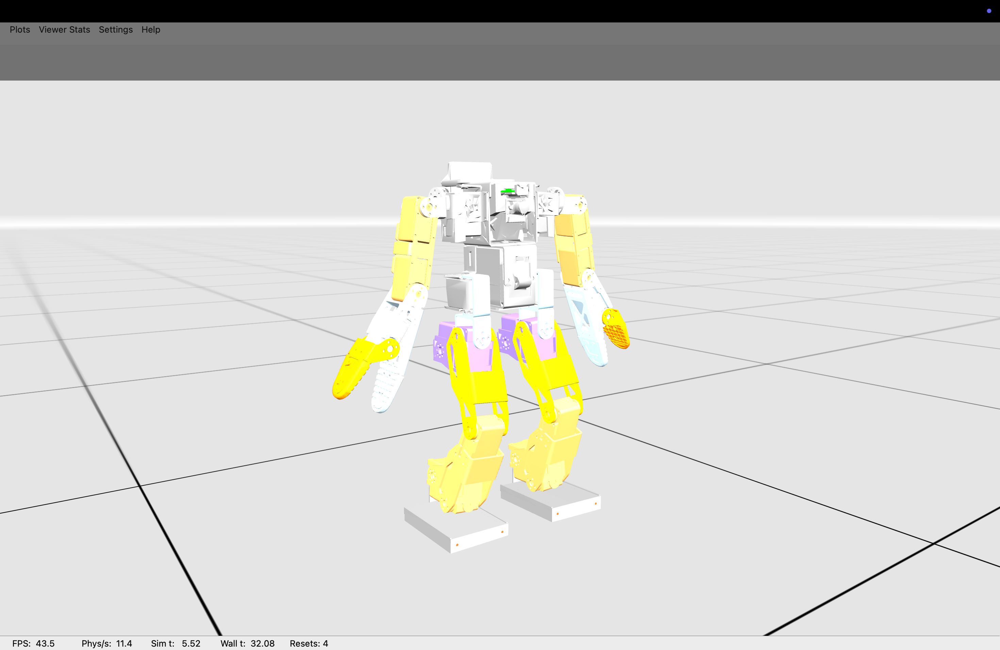

# ZBot Push-to-Kneel Controller

<div align="center">

*Portfolio project for Robotics & Embedded AI MSc applications: PPO-trained controller for Zeroth-01 humanoid (MuJoCo + K-Sim).*

**Training a humanoid robot to recover from pushes and kneel safely when recovery is impossible.**



*Trained policy walking in MuJoCo (195K-param GRU PPO, M2 Air CPU)*

[**PDF Report**](docs/report.pdf) | [Design Doc](docs/design.md) | [Results](docs/results.md) | [Limitations](docs/safety.md)

</div>

## Problem

Humanoid robots fall catastrophically when pushed beyond their balance limits, risking damage to the robot and environment. This project trains a controller that attempts push recovery and, when that fails, transitions to a controlled kneel to minimize impact.

## Approach

- **PPO with JAX/KSIM**: Proximal Policy Optimization using K-Scale's simulation framework
- **GRU-based policy**: Recurrent neural network with mixture-of-gaussians action distribution
- **Reward shaping**: Forward velocity, upright bonus, gait timing, joint limit penalties
- **Laptop-optimized**: 195K parameter model trainable on M2 Air CPU (~30s/step)

## My Contributions

Extended the [ksim-gym-zbot](https://github.com/kscalelabs/ksim-gym-zbot) template with:

- **KSIM 0.2.10+ migration**: Updated deprecated APIs, dict-based observations, new event system
- **Custom Mixture-of-Gaussians actor**: Local implementation for action distribution
- **Feetech actuator model**: Servo simulation with torque limits matching real hardware
- **Laptop-scale training config**: Reduced model (64 hidden, 3 layers) for CPU-only RL
- **Full documentation**: Design doc, results analysis, limitations writeup

## Results

| Metric | Value |
|--------|-------|
| Training steps | ~550 |
| Total reward | 2.0 → 2.4 |
| Forward velocity | 0.64 → 0.78 |
| Model size | 195K params |

See [docs/results.md](docs/results.md) for detailed analysis and TensorBoard plots.

### Status

| Phase | Status |
|-------|--------|
| Forward walking baseline | Done |
| Push curriculum | Planned |
| RECOVER/KNEEL state machine | Designed ([docs/design.md](docs/design.md)) |

## Quick Start

```bash
# Setup
conda create -n zbot python=3.11 -y && conda activate zbot
pip install -r requirements.txt

# Train (laptop defaults)
python -m train

# Watch trained policy
python -m train run_mode=view load_from_ckpt_path=results/ckpt.bin

# Resume training from checkpoint
python -m train load_from_ckpt_path=results/ckpt.bin
```

## Training Configuration

| Parameter | Laptop (CPU) | GPU |
|-----------|-------------|-----|
| `num_envs` | 8 | 256+ |
| `batch_size` | 4 | 64 |
| `hidden_size` | 64 | 128 |
| `depth` | 3 | 5 |
| `num_mixtures` | 3 | 5 |

## Technical Details

- **Observations**: Joint positions/velocities (40), IMU orientation (4), commands (6) = 50 dims
- **Actions**: 20 joint position targets (mixture of 3 gaussians each)
- **Rewards**: `stay_alive`, `upright`, `forward`, `feet_airtime`, `arm_pose`, etc.
- **Terminations**: Bad Z height, not upright, episode length

## Repository Structure

```
zeroth-fall/
├── train.py              # Main training script (task, model, rewards)
├── convert.py            # Checkpoint → kinfer conversion
├── docs/
│   ├── report.pdf        # Technical report for applications
│   ├── design.md         # Implementation plan and architecture
│   ├── results.md        # Training results, plots, videos
│   └── safety.md         # Limitations and future work
├── results/
│   ├── demo.mp4          # Demo video
│   ├── ckpt.bin          # Best checkpoint
│   └── plots/            # TensorBoard exports
└── zbot_walking_task/    # Training runs (gitignored)
```

---

**Maintainer**: [Nicolás Burgos](https://nicolasburgos.com)

## License

MIT
