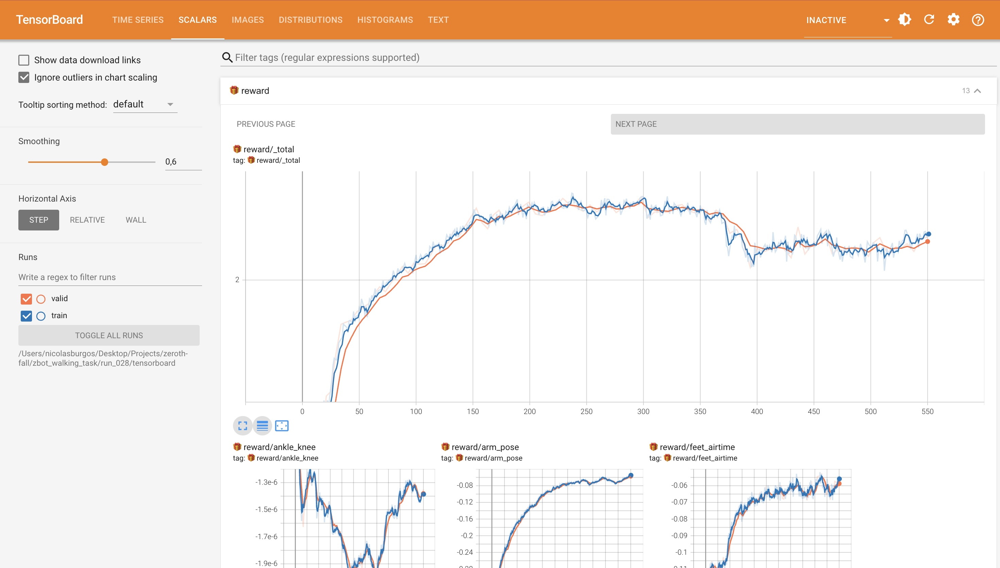

# Zeroth-01 Push-Recovery and Controlled Kneel Controller

**Nicolas Burgos** | December 2024

---

> **Summary**
>
> | | |
> |---|---|
> | **Model** | GRU PPO (195K params, 3 layers, 64 hidden) |
> | **Simulation** | MuJoCo + K-Sim, 20-DoF Zeroth-01 humanoid |
> | **Hardware** | MacBook Air M2 (24 GB, CPU-only) |
> | **Key Result** | Total reward 2.0 → 2.4, forward velocity 0.64 → 0.78 |

---

## 1. Problem and Motivation

Humanoid robots face a fundamental challenge: when pushed beyond their balance limits, they fall catastrophically. Unlike wheeled robots that can simply stop, bipeds have a narrow stability margin and high center of mass. A fall can damage expensive hardware, injure nearby humans, or destroy the robot entirely.

This project addresses fall mitigation through two complementary strategies:

1. **Push Recovery**: Active stepping and ankle torque adjustments to regain balance after disturbances
2. **Controlled Kneel**: When recovery is impossible, lower the center of mass safely rather than toppling

The controlled kneel approach is inspired by biomechanics research on eccentric muscle control—the same mechanism that allows humans to sit down gently rather than collapse. The goal is a policy that knows when to fight for balance and when to yield gracefully.

---

## 2. System Overview

### Simulation Framework

The project uses **MuJoCo** physics simulation via **K-Scale's KSIM** library, which provides:

- Vectorized environments for parallel rollouts
- MJCF robot model of the Zeroth-01 biped (20 actuated joints)
- Domain randomization (friction, mass, sensor noise)
- Push disturbance events during training

Training uses **Proximal Policy Optimization (PPO)** implemented in **JAX** with JIT compilation for efficient CPU/GPU execution.

### Policy Architecture

| Component | Specification |
|-----------|---------------|
| Policy Network | 3-layer GRU (recurrent) |
| Hidden Size | 64 units |
| Action Distribution | Mixture of 3 Gaussians per joint |
| Total Parameters | 195,061 |
| Observations | 50 dimensions |
| Actions | 20 joint position targets |

The recurrent architecture allows the policy to integrate temporal information—essential for dynamic balance where history matters.

**Observation Space (50 dims)**:
- Joint positions: 20 dims
- Joint velocities: 20 dims
- IMU orientation: 4 dims (quaternion)
- Velocity commands: 6 dims

**Action Space (20 dims)**:
- Position targets for each joint, output as mixture-of-gaussians for exploration

### State Machine Concept

The full system design includes a deterministic state machine for mode switching:

```
RECOVER → KNEEL → STABLE
   ↑         │
   └─────────┘ (if conditions improve)
```

Transition triggers:
- **RECOVER → KNEEL**: Tilt exceeds threshold (0.5 rad) for 10+ consecutive frames
- **KNEEL → STABLE**: Robot reaches stable kneeling configuration

This project demonstrates the training pipeline; the state machine is designed but not yet integrated into training.

---

## 3. Key Methods

### Reward Design

The reward function balances multiple objectives:

| Reward Component | Weight | Purpose |
|-----------------|--------|---------|
| `forward_velocity` | +5.0 | Encourage locomotion |
| `stay_alive` | +1.0 | Survival bonus |
| `feet_airtime` | +2.5 | Alternating gait timing |
| `arm_pose` | -2.0 | Keep arms stable |
| `lateral_velocity` | -1.0 | Discourage sideways drift |
| `joint_limits` | -10.0 | Penalize limit violations |
| `action_rate` | -0.1 | Smooth control outputs |

The reward weights were tuned empirically. Higher weights on `forward_velocity` and `feet_airtime` produced more stable gaits than uniform weighting.

### Curriculum Considerations

Training includes randomized push disturbances via `LinearPushEvent`:

| Stage | Force Range (N) | Interval (s) |
|-------|-----------------|--------------|
| Easy | ±20 | 2-4 |
| Medium | ±40 | 1.5-3 |
| Hard | ±60 | 1-2.5 |
| Kneel Trigger | ±100 | 1-2 |

Pushes are applied to the robot's torso at random intervals, teaching the policy to maintain balance under perturbation.

---

## 4. Results

### Training Configuration

| Parameter | Value |
|-----------|-------|
| Environments | 8 (parallel) |
| Batch Size | 4 |
| Rollout Length | 2.0 seconds |
| Learning Rate | 3×10⁻⁴ |
| Training Steps | ~550 |
| Hardware | MacBook Air M2 (CPU) |

### Learning Curves

**Total Reward Progression**



The policy converged from an initial reward of ~2.0 to a plateau around 2.2-2.4 over 550 steps. The plateau indicates the policy has reached a local optimum for the current reward weights.

**Forward Velocity Reward**


Forward velocity improved from 0.64 to 0.78, demonstrating the policy learned to walk forward. Oscillations reflect exploration of different gait patterns.

### Component Analysis

| Reward | Start | End | Interpretation |
|--------|-------|-----|----------------|
| `_total` | 2.0 | 2.4 | Overall improvement |
| `forward` | 0.64 | 0.78 | Better locomotion |
| `arm_pose` | -0.28 | -0.08 | Arms more stable |
| `feet_airtime` | -0.10 | -0.06 | Improved gait timing |
| `lateral_vel` | 0.5 | 0.7 | Less sideways drift |

### Simulation Demo


The trained policy demonstrates basic forward walking with reasonable gait timing. The robot maintains balance during normal operation and shows rudimentary push recovery behavior.

---

## 5. Engineering Challenges

This section describes non-trivial problems encountered during development.

### KSIM 0.2.10+ API Migration

The [ksim-gym-zbot](https://github.com/kscalelabs/ksim-gym-zbot) template was built for an older KSIM version. Updating required:

- **Dict-based observations**: Methods like `get_observations()` now return `dict[str, T]` instead of lists
- **New event system**: `LinearPushEvent` replaced `PushEvent` with different parameter names (`linvel` instead of `force`)
- **Termination API**: `BadZTermination` uses `min_z`/`max_z` instead of `unhealthy_z_lower`/`upper`
- **Noise specification**: `ksim.AdditiveGaussianNoise(std=...)` instead of float values

### Mixture-of-Gaussians Implementation

The template's action distribution didn't match the current Equinox/JAX patterns. I implemented a local `MixtureOfGaussians` class that:

- Outputs mixture weights, means, and log-stds for each joint
- Computes log-probabilities correctly for PPO's objective
- Provides both `sample()` and `mode` for training vs. evaluation

A subtle bug: `mode` was implemented as a `@property`, but I initially called it as `mode()`. This caused shape mismatches that took time to debug.

### Laptop-Scale Training

GPU clusters weren't available, so I adapted the training config for M2 Air:

| Original | Laptop |
|----------|--------|
| 256 envs | 8 envs |
| batch_size=64 | batch_size=4 |
| hidden_size=128 | hidden_size=64 |
| depth=5 | depth=3 |
| num_mixtures=5 | num_mixtures=3 |

This reduced parameters from ~1.1M to ~195K and made training feasible (~30s/step on CPU). The tradeoff is less expressive policy, but sufficient to demonstrate learning.

### PPO Shape Debugging

JAX's JIT compilation defers errors until runtime, making shape mismatches hard to trace. Issues encountered:

- Actor/critic carry states had different shapes due to separate GRU instances
- Log-prob computation required careful broadcasting for mixture components
- Observation dict keys had to match exactly (silent failures otherwise)

---

## 6. Limitations and Future Work

### Current Limitations

**Simulation Only**: This project operates entirely in simulation. Real-world deployment would require:
- Careful actuator modeling (the simulated Feetech servos may not match real dynamics)
- Sensor noise characterization
- Safety systems (e-stops, joint limit enforcement)
- Tethered testing before untethered operation

**Partial Implementation**: Several designed components are not yet implemented:
- State machine integration with training
- Formal evaluation battery
- Controlled kneel mode (design complete, training not started)
- Domain randomization sweep

**Scale Constraints**: Training was performed on laptop CPU (~30s per step) rather than GPU cluster. Results demonstrate the pipeline works but are not optimized for performance.

### What I Would Investigate Next

1. **Kneel Mode Training**: Train a separate policy with `mode=1` input, starting from unstable initial conditions
2. **State Machine Integration**: Run combined training where the mode switches based on tilt/angular velocity
3. **Quantitative Evaluation**: Implement `push_battery.py` and measure recovery rates systematically
4. **Sim-to-Real Gap**: If hardware access were available, characterize how policy performance degrades on real robot

### Open Questions

- How should the kneel reward balance "lower COM quickly" vs "minimize impact"?
- What tilt threshold optimizes the RECOVER→KNEEL transition?
- Can a single policy handle both modes, or are two separate policies more robust?

---

## References

- K-Scale Labs. *ksim-gym-zbot*. https://github.com/kscalelabs/ksim-gym-zbot
- Schulman et al. (2017). Proximal Policy Optimization Algorithms. arXiv:1707.06347
- MuJoCo Physics Engine. https://mujoco.org
- Zeroth Robotics. *Zeroth-01 Humanoid Platform*. https://github.com/zeroth-robotics/zeroth-bot

---

*Code and training artifacts: [github.com/nicoburgos/zeroth-fall](https://github.com/nicoburgos/zeroth-fall)*
